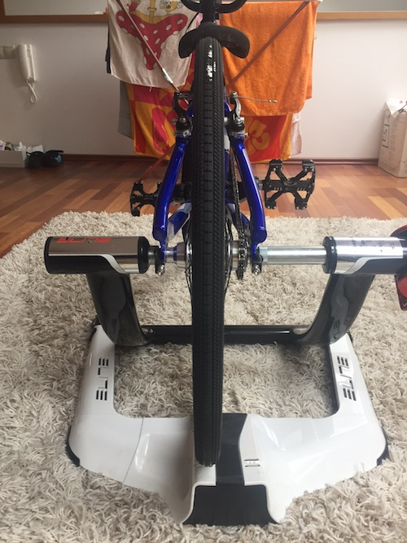

echo "

# elite-trainers

This document describes my personal experiences with bike trainers and specially the software from <http://www.elite-it.com>.

They are wonderful, and I love them and have a big respect to the
elite company team, for the work they have done and for what they deliver. This is my honest statement, regardless of what you read next. 

# TL;DR

- Yes, buy, they will work for reasonable money.
- Trouble free ? NO

... If you are not and IT geek or not in multi-riders, multi-trainers, multi-iphones, 
multi-sensors and no windows situation as me (but I'm probably crazy in this, right ?).

## Background Story

I'm a lame cyclist and IT professional with enough passion and money to have: 

- my own 2 kids with their 3 bikes (1x20'' BMX, 1x 20'' MTB, 1x 24'' MTB) ,
- legal wife with 1 bike (26'' MTB)
- and me having 2 bikes for my self (24'' BMX and 26'' MTB, which is more line 27,5'' when pumped) 

This range of wheel sizes is my main motivation for choosing EXCELENT elite as 
the brand. See [wheel sizes compatibility sheet](http://cdn.elite-it.com/sites/default/files/elite-compatibilita-rulli-ruote-en_0.pdf).

Having so many bikes, and bikers at home I ended up having 2 machines now:

- [QUBO POWER FLUID](http://www.elite-it.com/en/products/trainers/indoor-trainers/qubo-power-fluid-0), I have more than one year
- [QUBO DIGITAL SMART B+](http://www.elite-it.com/en/products/trainers/indoor-trainers/qubo-power-smart-b) which I have since yesterday (18.1.2016)

I also we have several devices at home:

- iPad 3
- iPhone 6
- and some sort of Android (which I do not know how to operate , so it is not included here in detail)

I also have Apple TV (4th generation) and one TV.

I also decided to be an 'assistant trainer' at the local BMX club lately, 
which I can use as an excuse for 
my interest and money spend on trainers machines experimenting.

## Review

Explained my IT background, bike ranges and lame cycling, here are my experiences.

### HW - trainers

Beautiful pieces of hardware, elegant , easy to assemble and the axle bundled with them is really helpful, if you do not want to destroy your original one. 

Takes 10 minutes to build it up and have it running.

Beware: always use pad under the machine, if you do not you will destroy your wooden floor. Even if the pads and plastic, it can leave scratches when you move the trainer, to clean the flat or just by sprint pedaling.

### Wheels and noise

Kids wheels are fine (9 years on any wheels will not produce to much noise), 
but for my MTB I had to build a special slick wheel, 
otherwise the noise is terrible (we have neighbors under out flat).

The Fluid machines itself are super silent (good job, elite team).

### Mechanical - QUBO POWER FLUID

I have used this without any electronics for a while.
It works well with well defined speed/power characteristics and
just shifting on your bike. Nice. 

### Mechanical QUBO POWER FLUID + 3rd party speed and cadence meter

One day, I have decided to buy cadence and speed meter from e-bay.
I have installed several apps and used the trainer with them, all fine and then i Have mad a mistake, I have remembered the poster packed with trainer machine, 
and the 'fun' started.

I have installed [My E-Training](http://www.elite-it.com/en/products/trainers/app/app-my-e-training) on iPhone and hoped it will connect to Chinese speedometer.

It did ! (great job), for 20$ I had a digital trainer now.
Could ride on map, by video, by training program...

But, it did not go harder when climbing the hill nor easier when riding downhill.

### Going Digital (QUBO DIGITAL SMART B+) 

Happy with the mechanical QUBO POWER FLUID with Chinese gadget,  
I have decided to buy also QUBO DIGITAL SMART B+. B+ is for Bluetooth.
And I hoped I will not need to buy a ANT+ dongle (no worries, no need, good job elite team).

Expected to measure speed, cadence (I already had for 20$) and 
having a mobile controlled resistance based on Watt power in trainings program, 
and elevation profile in videos and maps.

Yes it all works (good job). Even if the cadence is ['fake'](TODO: link), it seems to 
measure and display something. 

(TODO: numbers will be tested/compared against the Chinese gadget soon)

### Narrow Frames (23.7.2017)

Even if the trainers are targeting sizes from 20'' it seems that narrow frames (like BMX racing bikes) do not fit well from side-to-side position. Even if you are able to clamp them and they hold, they are shifted from center too much. So much that with the rotor already totaly to left, it looks like this (If you ride you may damage plastics of rotor, with anything bigger than 1 1/8 tires).

It would be perfect if elite could provide alternative length for this fixed side of clamp, or just make both sizes adjustable:

To get it perfectly in the middle (without adjustable shift of rotor)
we are talking approx about this distance

### My E training

I tried to use 'both variations of my trainer machines' with My E Training application, 
which is free , but usable only after paying 10$ a year subscription. (click, click, click I have a full version now with year subscription). And now the 'fun starts'.

See my quick click click demo of the app here: <https://youtu.be/5E2mPJ-FtHg>

This is the official (static and obsolete) [help](http://www.elite-it.info/myETraining/helpEnglish_v1.htm).

In the following chapters I will try to comment on usability of each feature and
also about my 'progress' with support from elite help desk.

#### Settings

	The app must be configured when first loading it so that it perfectly matches your hometrainer. 

- (cons) Application is unusable without setting trainer machine and sensors. If you just want to download videos, or creating new training program you HAVE TO SETUP training machine type, and even to setup sensors. If you have no sensors, application is UNUSABLE for anything. VERY BAD DESIGN !

- (cons) it allows you to set only one training machine, one type of sensor and one rider parameters (bike wheel size, weight, age). if you are in my situation having 4 riders with at least 2 bikes, it means switching manually configuration when the riders change. I expect it is more usual to have more riders the smart phones in family, I would suggest to have 'profiles' and being able to switch them quickly (even my 30$ Withings scale have it), so for 300+ $ machine + 10$ SW for a year subscription, that would be a fair requirement. Or not ?

	----------------------------

	Good morning,

	thanks to get in touch with us and for the interest on our product.

	This option is really good, we will strongly take care to put into next app version.
	Thank you for your suggestion.

	I remain at your disposal.

	Kindly

	Edoardo
	Elite srl
	-----------------------------
	
	I have 2 trainers and 3 riders using them, each rider has different bike .
	However i have only one iPhone.

	It would be nice to have option to configure several sets of parameters and save them as profiles and to quickly switch them when we switch rider or trainer.

	Thanx

	

- (cons) probably cannot be used at all without speed and cadence sensor, eg. measuring only HR is not possible

#### Settings - using  real cadence sensor

QUBO DIGITAL SMART B+ has no cadence sensor, not a real one, the cadence is 'approximated'.
How good is it ? Bad. Bad for BMX sprints, bad for short intervals where you want to measure max rpm achieved in few second sprints.

Oh, I'm safe, I own a separate cadence sensor so let's connect it.

Impossible: 

	

- (cons) - does not support additional cadence sensor over BT, only ANT+, 
- (cons) built in cadence is approximation which ignores short time peaks, and is not 
precise enough for spints and max rpm trainings.

<http://www.elite-real.com/en/forum/connecting-additional-bt-not-ant-sensor-qubo-digital-smart-b>

How do I know the cadence from QUBO DIGITAL SMART B+ is not accurate, if I can not connect
two sensors ? Easy I have 2 devices iPhone connected to external cadence sensor and 
iPad connected to built in sensor. Just take charts of cadence from both and you will easily see the diffidence.

#### Base training sessions (UX - User Experience)

- (cons) UX Design ? Just 3 items on the screen, 
wand they do not fit in my iPhone 6 'large' display ?
- (suggestion) Please could you make smaller ? No scroll for 3 items ?

#### Conconi test

After my first try, I have failed to interpret any results on my phone and reported to Elite (issue 7709 !!!)

[Original help for mobile MyETraing app](http://www.elite-it.info/myETraining/helpEnglish_v1.htm), 
contains some not very precise info, but support team have sent me a 
[link to Conconi test manual](https://elitesrl.zendesk.com/attachments/token/FmSnRSDs2vJxbH8w9lV2xnUAU/?name=ELITE_1401_0350_MANUALE+CONCONI_TEST+rev05.pdf).

Anyway:

- (cons) graphs on mobile are unreadable
- (cons) algorithm for scoring (how well you have followed the protocol) shows full score (good) byt results show negative values and other nonsence (TODO: screen shots ?)

Export to CSV and excel and some manual work - yes I know how to interpret this, so my 15+15+25 mins biking was not useless and I know my LT based on Conconi. Actually not so different from my FTP test results.

Look at what I have got from my mobile:

Can you read this ? Again bad labels on Axes in charts, totally unreadable, bad data displayed.
Negative values and correctness core of 10.

#### Custom Programs (Horror)

I'm not a road cyclist, I need my own program. In seconds, 
not minutes or hours intervals.

- (cons) painful UI to create intervals with current UI.

	issue reported

Also the programs you create in hours, then disappears, and your work is lost.

- (cons) Saving program is unreliable (at least, when using more then one device)

	issue reported

#### Downloads of My real Videos

- (cons) terrible access (UX) need to go to menu, no quick access to downloaded videos)

#### Elevation Profiles

-(cons) - totaly unreadable, not min, max, no gridlines, 
no text indicating current elevation (reported).

#### Apple TV and big screen

I have managed to connect it to apple TV, as well to AirServer running on my iMac.
So I can use both trainers with bigger screens now.
However the screens do not rotate, and the landscape screen has a lot of empty spaces around,
so it seems very silly. I had to post about this on [Facebook](https://www.facebook.com/ainthe.kitchen/posts/1210313258996354).

- (cons) looks stupid on big screen (reported to Elite)

### iOS Not Supported ?

As I have mentioned I gave me + 3 more raiders but only one TV.
Now with 2 trainers it is a problem of sharing space and screen, so I have 
naively hoped, I will install My E Training on OSX and have it on my big mac screen.
Fail. 

- (cons) Elite has no OSX version as far as I know.

Not even in road map ? <http://www.elite-real.com/en/comment/reply/8131/7241>

#### Exports, Sharing

Any UI sucks (in general)
I want the data and will create my own UI. 
For my own purposes. What are my chances ?

Nice, CSV export (by email) looks like this:

- (pros) exporting as CSV
- (cons) one by one ? why not exporting multiple sessions ?
- (suggestion) allow to select multiple items and export at once. Thanx a lot.

##### Fix Speed (for Golden Cheetah)

- (cons) TCX export seems buggy, at least GC team things so, see <https://github.com/GoldenCheetah/GoldenCheetah/issues/1826#event-536594743>, 

Elite says Strava and Garmin want kmph, GC says that mps is correct by specs.
Anyway, I'm not waiting for any of the teams to fix this (2 months of no help) so I have created workaround.

To be able to import .tcx files from elite to GC, I gave created small bash script, using Java.

This translates Speed elements from kmph to mps as expected by GC.

See ./bin folder or simply run

	./bin/fix-speed ./bin/sample.kmps.tcx > ./bin/sample.mps.tcx

#### Heart rate monitors

- (pros) - tested with Suunto Smart Sensor Bluetooth Heart Rate Monitor, seems to work

### If not (non ideal) My E Training then what ?

- Zwift - Fail - iOS app forces you to install OXS app to register for trial, 
just to find out that none of them works with BT and you shell buy ANT+ dongle ? Jokes or my bad, I do not know.
- Kinomap - Fail -$6 a months - grrrr
- Trainer Road - Fail -99$ ? quit before even trying 
- bkool - Fail on El Capitan did not pair with built in elite now Chinese gadget over BT
- TrainerRoad - Fail as well (no not remember must try again)

- Golden Cheetah - failed buggy exports (reported)

- (cons) nor TCX nor CSV exported from phone can be easily imported to [GolderCheetah](http://www.goldencheetah.org/)

# References

Other reviews covering elite trainers:

- <http://www.dcrainmaker.com/2014/11/winter-trainer-depth.html>
- <http://sportivecyclist.com/elite-chrono-fluid-elastogel-indoor-trainer-review/> 

"

